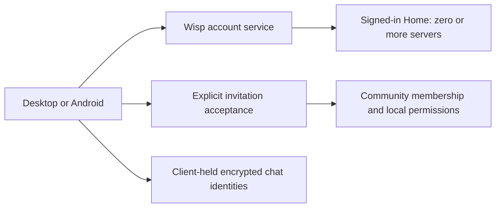

# Accounts, invitations, and adding friends

Status: original research and longer-term design, based on desktop main `18141f5`
and the Android preview. The deployable first implementation is specified in
[account-and-invitation-protocol.md](account-and-invitation-protocol.md). It uses
existing account authentication with explicit community membership, not a new
OIDC authority. The future authority/federation sections below are proposals,
not shipped behavior. HTTPS links use the canonical backend `/join/#v2.…`, with
an encrypted capsule and local QR; friends/DMs work on that account service
without joining its community. Independent hosts keep their existing accounts.
Updated September 11, 2026 with the requirement for accounts without servers.
No new invite format, client behavior, server endpoint, or deployment is included
in this document. The example domains and link placeholders are not real invites.

## Recommended experience

Let someone **create an account and sign into Wisp without an invitation or any
server membership**. An account with zero servers is a normal signed-in state.
Joining a community, adding a friend, and joining voice are separate actions.

Make **Invite to server** and **Add friend** separate actions. A server invitation
is a normal HTTPS link, with Copy, Share, and Show QR controls. Opening it supplies
the server automatically and leads to an explicit acceptance screen. A person
already on the same server is added through a searchable member list and the
existing friend-request system, without exchanging a code.

Use a small encrypted invitation record to shorten the link without publishing
the current media key. Start with a first-party invitation endpoint for the
configured community, exposed through a branded join page. Independent hosts
can expose the same endpoint on their own domains. A public server-discovery
directory is unnecessary. Account identity and membership must nevertheless be
separate; simply removing the invite field from today's registration is unsafe.

## Discord reference and Wisp decisions

These are observations from Discord's official documentation, not claims about
its internal backend. The Wisp column is our recommendation.

| Area | Discord reference | Wisp decision |
| --- | --- | --- |
| Account creation | Registration works directly in the app or browser; an invitation is an alternative entry point. [Registration guide](https://support.discord.com/hc/en-us/articles/31676852332439-Discord-Sign-Up-and-Registration-Guide) | Create account / Sign in first. Neither requires a community. Preserve a pending invitation across sign-in without accepting it automatically. |
| Joining | A separate Join a Server action accepts a link; an invite acceptance screen can expose privacy choices before joining. [Joining guide](https://support.discord.com/hc/en-us/articles/360034842871-How-do-I-join-a-Server) | Preview the community, then explicitly Join server. Never join voice, start media, or create a friendship as a hidden side effect. |
| Adding friends | Add by username or directly from a person's profile; requests have a pending state and recipient acceptance. [Friends List 101](https://support.discord.com/hc/en-us/articles/217674288-Friends-List-101) | Add friend from member/profile menus; support a memorable account handle for people who do not share a server. Keep pending requests visible in Home. |
| Names | A unique username identifies an account; a separate display name is the prominent conversational name. [Names guide](https://support.discord.com/hc/en-us/articles/12620128861463-New-Usernames-Display-Names) | Separate public handle, display name, and immutable account ID. Existing private server-login usernames do not become public automatically. |
| Invitations | Invite creation offers copying or sending to contacts, editable expiry/use counts, and administrative removal. [Invites 101](https://support.discord.com/hc/en-us/articles/208866998-Invites-101) | One compact share dialog with Copy / Share / QR and secondary expiry/revoke controls. Keep single-use invitations initially; the current media-key model needs review before reusable public invites. |
| Contact privacy | Friend-request eligibility and nonfriend DM permissions are configurable. [Privacy settings](https://support.discord.com/hc/en-us/articles/217916488-Blocking-Privacy-Settings) | Keep requests consent-based and add account-level blocking/request controls alongside global discovery. Avoid automatic address-book upload. |

### First launch with no invitation

1. Show **Create account** and **Sign in**, with **Join with an invitation** as an
   alternative entry point. No server address is required for a Wisp account.
2. Complete account creation/sign-in against the Wisp account service. A public
   handle and display name are distinct; recovery details remain private.
3. Open **Home** with the profile/settings available and an empty server list.
   Say **No servers yet** and offer **Join a server**. **Create a server** can
   enter a real setup/hosting flow; do not suggest a community was provisioned
   when only an account was created.
4. Dismissing onboarding, cancelling an invite, or later leaving the last server
   returns to this same usable state. It must not log the person out or prompt
   for a server address again.

Home is distinct from the user's preferred **home servers** setting. It should
remain available even when that preference has no entries. Desktop uses a stable
Home entry outside the server selector; Android uses touch navigation for Home,
Servers, and Profile. Empty lists must not show stale members, a disconnected
community warning, or disabled controls for a nonexistent voice room.

For the proposed complete experience, friends and DMs belong to the account,
so leaving a server does not remove friendships or conversations. Whether this
ships with the first account release or immediately after it is the outstanding
scope question. Server-free signup/sign-in and the empty-server state are firm
requirements either way. Do not advertise global messaging until its backend and
encryption/device flows work independently of a community.

### Sender

| Entry point | What it does |
| --- | --- |
| Server menu → **Invite to server** | Creates a server-membership invitation. Shows Copy link, Share, Show QR, expiry, and Revoke. Does not automatically make the recipient a friend. |
| Home → Friends → **Add friend** | Enter an exact public account handle, share your profile, or scan its QR. Shows a profile and explicit Send request action. Shared-server member search also remains available. |
| Person menu → **Add friend** | Uses the existing consent-based request flow. No link, username, or code is needed. |
| Add friend → **Share my profile** | A profile link or QR helps someone sign up and send a friend request without joining a server. It grants neither account access nor membership. |
| Private room → **Invite** | Remains an administrator-controlled admission to that room. The label and acceptance screen identify the extra access. |

Keep invite expiry and one-use status visible without crowding the share controls.
Retain the current 30-minute UI default initially; offer a longer, explicit
24-hour option for someone who needs to install. Revoke invalidates enrollment
and deletes the encrypted record. Creating a replacement never silently extends
an already shared link.

The displayed link is short enough to share, not intended to be typed. The
proposed shape is `https://wisp.you/j/#v2.<random-secret>` for the configured
first-party instance, or the equivalent on an independent host. A 256-bit random
secret is 43 base64url characters; the whole branded URL would be about 66
characters, rather than a JSON package containing the server and media key.
The domain/path are proposed routing, not currently deployed behavior.

### Recipient

1. Tap the link, scan the QR code, or explicitly paste it in **Join a server**.
2. Wisp resolves the invitation and shows the community name, inviting person,
   expiry, and any private-room admission. The server's domain remains
   inspectable for trust; its address is not an input field.
3. Use the signed-in Wisp account, sign in, or create one. Return to the pending
   invitation after authentication. Existing independent server accounts use a
   clearly labelled compatibility flow; do not silently merge them by name.
4. Choose **Join server**. A generic server invitation creates membership without
   friendship. Offer **Add inviter as friend** separately after joining.
5. Open the server's text/home view. Voice, microphone publishing, camera, and
   screen sharing remain off. Joining a voice room is a separate action.

**Join a server** supports link paste and QR scan. Saved servers appear by name.
Manual server entry belongs under **Advanced → Connect to an independent
server**, not at the top of account onboarding. An invitation supplies any
community address needed on a new device.

An existing account's chat private keys are a separate concern: a friend/server
invite must never contain the inviter's recovery vault, device credential, or
the recipient's identity backup. Keep Android's existing recovery import step
when a known account's private keys are missing; explain it as **Restore encrypted
chats**. A future trusted-device pairing flow can remove that file-transfer step,
but silently creating replacement identity keys is not an acceptable shortcut.

### When Wisp is not installed

The same HTTPS URL opens a small landing page with **Get Wisp**, **Open Wisp**,
and **Copy invitation**. Display a generic Wisp invitation preview on the web;
do not expose a private server name, inviter, room, or key to messenger previews.
The full acceptance card appears in the native app after resolution.

For the current Android APK distribution, the honest flow is **Install → return
to this invitation → Open Wisp**. Do not promise automatic continuation across an
APK install. Preserve the original link in the page and offer explicit copy/paste
as a fallback; do not silently read the clipboard or add tracking/fingerprinting.
On desktop, the page's Open Wisp button uses the registered custom URI handler.

Android should use verified App Links for Wisp-owned join domains, including the
actual application ID and signing-certificate fingerprints in `assetlinks.json`.
App Links route to the app when installed and to the website otherwise.
[Android documentation](https://developer.android.com/training/app-links/about)

Self-hosted domains that cannot be predeclared in the Android manifest can still
use the browser page's explicit Open Wisp handoff, QR/paste, and strict native
URL validation. App-link verification is not a global-server discovery service.
The Play Install Referrer API is specific to Google Play; defer it until there
is a Play distribution plan and never put invite secrets into attribution data.
[Google Play documentation](https://developer.android.com/google/play/installreferrer)

## What the source currently does

| Current behavior | Consequence for this work |
| --- | --- |
| `apps/wispd/src/main.rs`, `create_account_invite`, adds `server`, `token`, `kind`, and `media_key` to base64url JSON. | Base64 is encoding. Redirecting or storing this plaintext package in a shortener would disclose the media key to that service. |
| `apps/wisp-server/src/lib.rs`, account invite/login/register handlers; migration 0014 | Invites are hashed, expiring and one-use. Both current invite kinds also create friendship when accepted. There is no generic membership-only invite kind. |
| Current account-invite routes | No account-invite revocation/listing API is exposed. Device revocation is separate. Add real invitation revocation rather than presenting an unsupported button. |
| `apps/wisp-server/src/friendships.rs`; `docs/server-members.md` | Existing members have searchable public names and recipient-approved requests. Login usernames, nonfriend presence, and private-room membership are deliberately excluded. |
| `apps/wispd/src/accounts.rs`; `docs/architecture.md` | Accounts and encryption stores are scoped by server. A stable local server ID derives from its canonical API origin. This is not a federated/global account system. |
| `quickshell/onboarding/shell.qml`; `apps/wispd/src/bin/wisp-account.rs` | A valid legacy long link already supplies the server, but the default login/register form still exposes manual server details. |
| Android `apps/android/README.md` | The preview starts with an HTTPS origin and raw invite code. Existing identity restoration is deliberate, and it currently supports one account/server per installation. |
| `website/playground-preview/content/sign-up.html`; `website/README.md` | Website signup records closed-beta interest and optional email subscriptions. It is not Wisp account registration or authentication. |

Keep the existing TOFU contact pins, identity-change rejection, signed room
membership chains, administrator-only private-room admission, and per-server
credential isolation. A new share-link format is not a new identity authority.

## Account and membership separation

Introduce a Wisp account service as an explicit identity authority. Community
servers continue to own their rooms, roles, admission rules, and encrypted room
traffic. These services can initially share owner-managed infrastructure, but
their credentials, data, and authorization boundaries stay distinct. Connecting
to the account service does not make the person a community member and must not
add a hidden server to their list.

The account service owns the stable account ID, explicitly chosen public handle,
profile, authentication, device/session management, and recovery. A private list
of joined communities can restore navigation on a new installation; community
membership must still be validated at the relevant server. Storing that list
introduces membership metadata at the account service and must be documented.
Do not store users' private chat keys or media keys there in plaintext.

Use a maintained OAuth/OIDC implementation for the new account authority and
native authorization-code flow with PKCE through the system browser. Register
the account authority explicitly; an invitation cannot change the login issuer.
The native-app security guidance recommends the external browser and requires
PKCE for public native clients.
[RFC 8252](https://www.rfc-editor.org/rfc/rfc8252)

Keep account-service refresh credentials on the device, not on community hosts.
Obtain short-lived resource access scoped to the intended community, validate
issuer/audience/expiry, and let that community enforce its own membership and
bans. An ID token for the native application is not a community API credential.
Use audience-restricted access and protected/rotating refresh tokens according
to current OAuth security guidance.
[RFC 9700](https://www.rfc-editor.org/rfc/rfc9700)
The provider, exact API schemas, recovery policy, and operational setup still
need implementation selection; this proposal is not a new custom auth protocol.

Do not simply make the current `invite_code` optional: today's authenticated
users can reach server-scoped directories and public rooms. Server-free accounts
must receive no room/member/event access until membership is granted. The
current `server_identity` record identifies an owner; it is not a server signing
key or a pre-existing global identity authority.

### Existing account migration

1. Preserve existing server users, IDs, roles, device credentials, friendships,
   message history, read cursors, and vault files. Existing clients keep working
   while the new account capability is introduced.
2. Offer **Link existing server account** after Wisp account sign-in. Require
   authenticated proof of both identities and explicit consent; equal display
   names or email strings are not proof. Do not copy password hashes to merge
   accounts or choose a private login username as the public handle silently.
3. Store the verified binding to the existing server user. Joining again must
   be idempotent and must not create duplicate members. Resolve conflicting
   bindings explicitly instead of taking over an existing identity.
4. Keep existing server-scoped chat key pins and signed membership chains. New
   device access to old encrypted chats still needs recovery/import or a reviewed
   trusted-device transfer. Account password recovery alone cannot recover a
   private encryption key that the service never possessed.
5. Until independently hosted servers support account linking, retain the
   advanced legacy login/invite flow alongside Wisp accounts. Never send global
   passwords or refresh credentials to a legacy server.

If global friends and DMs are included, add an account-level request/block graph
and encrypted DM transport that does not depend on any community. Use immutable
account IDs underneath changeable handles. Exact-handle lookup should avoid
exposing email, private presence, or a searchable dump of the user directory.
Legacy server friendships must not silently become global links between
identities users have not chosen to connect. Preserve existing DM histories
under their original encryption context during migration rather than rewriting
their participant IDs or pretending duplicate histories are one conversation.

## The link and key boundary

Use one **fresh, per-invitation random secret**, independent of any media key.
Native code encrypts a small invitation payload using an established AEAD library.
The payload contains the canonical server origin, inviter/room references,
underlying enrollment token, operation/consent fields, expiry, and the existing
server-scoped media key when required. The storage endpoint receives only an
opaque encrypted payload, a lookup identifier, expiry, and its authorization
binding. It never receives the fragment secret or plaintext media key.

An implementable envelope is AES-256-GCM with a fresh nonce and domain-separated
HKDF-SHA-256 derivation from the random secret; derive the lookup identifier with
a separate label. Bind the version, lookup identifier, and issuer origin as
authenticated data. Freeze byte encoding, size limits, derivation labels and
shared Rust/Kotlin test vectors before either client emits the format. Use
maintained crypto implementations, not QML crypto or a bespoke cipher.

The native app derives the lookup ID from the link fragment, retrieves the
encrypted record from that link's issuer, verifies/decrypts it locally, and
validates its canonical target origin before contacting the Wisp API. It must
not follow arbitrary cross-origin redirects or forward existing credentials to
a new origin. Public HTTPS/TLS requirements, explicit local-development handling,
and existing saved identity checks remain in force. Changing the branded join
domain must not change the canonical API origin used for account/vault scoping.

The fragment is not sent with ordinary HTTP requests. This helps keep it out of
web access logs and normal messenger previews.
[URI fragment behavior](https://developer.mozilla.org/en-US/docs/Web/URI/Reference/Fragment)
It is still a bearer secret: a browser page, messaging service, screenshot, or
clipboard recipient holding the full URL can read it. The join page therefore
needs minimal first-party code, no analytics or third-party scripts, strict CSP,
`Referrer-Policy: no-referrer`, no service-worker caching, no secret-bearing
redirects, and no automatic redemption. Keep the secret out of telemetry, errors,
crash reports, query strings, installation referrers, and public QR services.
Generate QR codes locally from the exact full invitation URL.

Fetching, opening, scanning, or previewing a link must never consume it. Only
the enrollment/acceptance transaction spends the underlying invitation. Invalid,
expired, used, revoked, and tampered links have clear recovery states; an invalid
capability must not reveal which account or private room it once referred to.
Retrieval must not act as a proxy that fetches arbitrary user-supplied hosts.

Deleting an invitation cannot erase a media key someone already obtained. The
current shared-media-key design already has that limitation; one-use enrollment
does not imply cryptographic revocation of downloaded data. Retain server
authorization for live media grants, and track per-device media-key distribution
and rotation separately. Do not imply that a short link solves that problem.

## Required work and compatibility

| Area | Required change |
| --- | --- |
| Accounts | Independently usable account registration/login, device/session revocation and recovery, empty membership list, profile/handle, optional legacy-account linking, and protected local account storage. Keep beta mailing-list consent separate. |
| Server | Capability discovery; new membership-only invitation type; encrypted-record create/upload/resolve; creator/admin list and revoke; authenticated membership acceptance; atomic redemption and idempotent retries. Keep permission checks at redemption, not only creation. |
| Storage and limits | Versioned invite records with hashed enrollment tokens, encrypted payload, expiry, revocation and use state. Cap payload size, active records, create/resolve/redeem rates, failed guesses and expensive password work. Start with configurable limits; test per-actor and global abuse, not just per-IP limits. |
| Desktop | Add account-level Home and explicit zero-server states in the daemon/bridge/UI. Replace the ambiguous server-level Invite friend action; add the share dialog and Add friend entry point; centralize invite resolution in Rust; accept using the current account without unnecessary device creation. |
| Android | Replace mandatory server-first onboarding with account-first navigation; represent no memberships separately from signed out. Add HTTPS App Links and QR/share/paste; retain pending invitations across activity recreation; preserve identity-restore behavior. Keep pending secrets protected and clear on cancel/expiry/success. |
| Website/hosting | A minimal join page, first-party encrypted-record routing, association files, platform install destinations, and privacy headers. Coordinate these with the website task; do not repurpose the separate signup service or its accounts implicitly. |
| Tests | Server-free signup/sign-in/restart and last-server leave; nonmember authorization; dual-proof legacy linking and key continuity; Rust/Kotlin envelope vectors; old/new links; expiry/revoke/use races; wrong-origin/issuer rejection; no private preview leakage; cold/warm app and install-return flow; no automatic voice join. |

Use a separate versioned API/type for the new consent semantics. Legacy account
invite kinds and their response enums must not start emitting unknown values to
old clients. Old long links remain accepted by updated clients and retain their
original explicit friend/room meaning; present that meaning on the confirmation
screen. Keep support for manually entering a server plus legacy code under
Advanced during the transition.

Negotiate capability before offering the new share format. An updated client on
an old server offers a clearly labelled legacy invitation; never upload a legacy
plaintext package to a relay as a fallback. An old client receiving a new link
gets the landing page and an update path, not a partially parsed enrollment.
The website's desktop-launch URI may wrap the HTTPS URL in a versioned custom
URI; it is a machine handoff, not the shared link. Bound parsing depth and size,
and reject missing/truncated fragments rather than guessing a server or token.

Roll out account and server support first, then compatible desktop/Android
parsers and UI, then enable generation of new links. No forced account linking,
friendship creation, key rotation, or voice reconnection belongs in that rollout.

## Design choices

| Option | Assessment |
| --- | --- |
| QR codes | Include now as another way to carry the same link. They improve phone entry but do not replace consent, expiry, or installation handling. |
| Friendly identifiers | Include an explicitly chosen public account handle and display-name search within shared servers. Do not expose private legacy login usernames. |
| Global `@name` discovery | Include with account-level friendships, using exact lookup, request consent, blocking, and abuse limits. The new independent-account requirement supplies the identity model this needs. A browsable global directory is unnecessary. |
| Very short numeric/word codes | Defer for bearer invitations containing key access. They reduce entropy. A short-code device-pairing flow would need separate confirmation, throttling and key-transfer design. |
| Plain opaque shortener → existing long URI | Reject: the service would store/return the embedded media key in plaintext. |
| Online inviter approves every new-device key transfer | A stronger future pairing/key-distribution direction, but requiring the inviter to stay online would complicate the basic invitation/install experience. |

## First implementation boundary

The release must cover both **no invitation** and **invitation received**. Ship
the account foundation first: create an account without a server, reopen/sign in
on another installation, use Home with an empty server list, and join a server
later. Cancelling an invite or leaving the last server must preserve the account.

Then complete one cross-platform invitation path: create an invitation on
desktop, open or scan it on the S23 Ultra, install/return when necessary, use or
create a Wisp account, explicitly accept, and arrive at text chat with media off.
Add member/profile-based friend requests and account handles with the independent
social backend. Freeze account capability/error schemas and encrypted-envelope
vectors before either client starts emitting the new format.

Acceptance tests must distinguish signed-out, signed-in/no-memberships,
signed-in/member, membership-revoked, server-unreachable, and identity-restore
required. An unreachable joined server is not the same as having no servers.
On Android cover cold and warm links, orientation/process recreation, keyboard
layout, touch targets, expiry during signup, and explicit return after APK install.

The Android task owns `apps/android` in its worktree. This task owns the shared
protocol/server/desktop implementation. The website
task owns join-page and association-file deployment in coordination with those
clients. A physical S23 Ultra pass is required before claiming the installation
handoff works on that device; emulator coverage is not a substitute.
