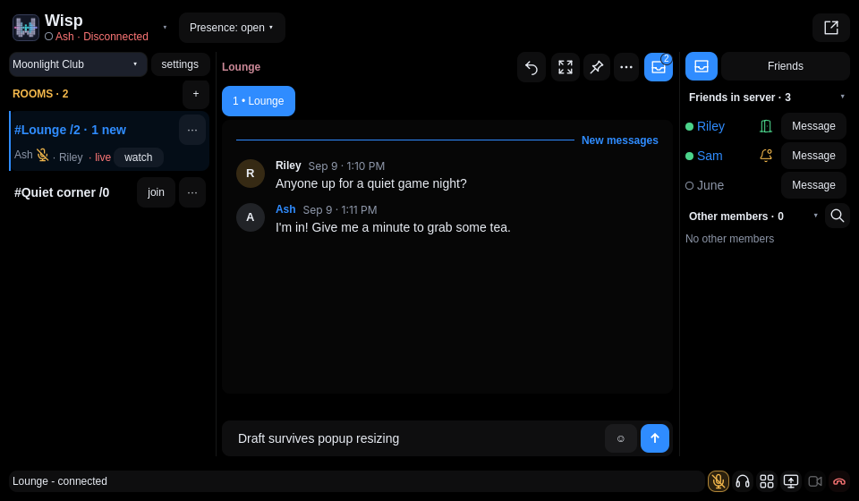

# Wisp for Omarchy

Voice, chat and friends in your Omarchy bar. A wide popup puts rooms on the left,
chat in the center, friends on the right, and audio controls within reach below.
The soundboard opens beside your mouse. Colors and typography follow your theme.



## Install

Requires **Omarchy 4.0.3 or newer** and the **Wisp desktop client**. This plugin is
the bar interface; Wisp handles your account, connection and media separately.

1. Install the latest [Wisp Linux client](https://github.com/Jared-Mac/wisp/releases/tag/main).
   The published Linux archive currently targets x86_64. Download its `.tar.gz`
   and matching `.sha256` file, check the checksum with `sha256sum -c`, then
   extract it and run `WISP_CLIENT_ONLY=1 ./install.sh` inside the extracted folder.
   Follow the [client setup instructions](https://github.com/Jared-Mac/wisp#run-it)
   for runtime dependencies or a source build. Ensure `~/.local/bin` is on PATH.
2. Run `wisp` and complete account/server setup. Use your own server or an invite
   from the server you want to join. No account or server credentials are bundled.
3. Add the plugin:

   ```bash
   omarchy plugin add https://github.com/Jared-Mac/omarchy-wisp.git --enable
   ```

If Wisp is missing, **Install Wisp** opens these instructions. The plugin does
not download or run an installer automatically. Opening it never joins a room.
Microphone, camera, screen sharing and sound playback require your actions.

## Use

Click the Wisp bar widget to open the popup. Right-click it to toggle microphone
mute. Choose a room or chat, use the bottom controls for your current call, or
select **Open app** for the full desktop workspace. Settings include soundboard
uploads, private previews and volume controls. `ffmpeg` is needed for importing
sounds, not for using existing soundboard buttons.

## Update

Update the Wisp client in **Settings → Updates** (or with `wisp-update`), then:

```bash
omarchy plugin update dev.wisp
```

Keep the client and plugin current together. This repository follows successful
Wisp `main` releases; `release.json` records the source revision. These are
pre-release builds. New releases are checked hourly and can be synced manually
by a repository maintainer. Wisp's client updater leaves Git-managed plugins
alone so Omarchy can update them cleanly.

Avoid editing installed files directly if you want automatic Git updates. If
switching from Wisp's old copied adapter, remove that adapter with the command
below first, then add this repository. Omarchy backs up non-Git plugin folders.

## Remove

```bash
omarchy plugin remove dev.wisp
```

Removing the bar plugin leaves the Wisp desktop client, account and chats intact.
It does not disconnect the running voice client.

## Development and license

[Wisp](https://github.com/Jared-Mac/wisp) is the source project. This repository
contains the plugin's QML, JavaScript and assets, public documentation and its
release-sync workflow. Report problems in the
[Wisp issue tracker](https://github.com/Jared-Mac/wisp/issues), including your
Omarchy version and the revision from `release.json`.

Licensed under [AGPL-3.0-only](LICENSE).
